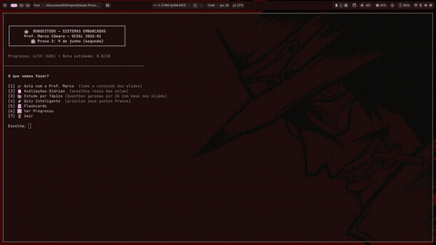

# 🤖 RoboEstudo — Sistemas Embarcados `v2.0`

Tutor interativo de terminal para a disciplina **Sistemas Embarcados** do Prof. Marco Câmara (UCSAL 2026-01).

Cobre todo o conteúdo das duas provas: aulas explicadas, questões de múltipla escolha, dissertativas, cálculos, código, flashcards, questões reais de avaliação e simulados completos no estilo da prova — com filtro por Prova 1 ou Prova 2.

> **v2.0** — Integração do pacote P2 (slides 244–392): +44 questões, +34 flashcards, 8 tópicos detalhados (Referências/WDT, ATMega/Registradores, ADC/DAC/PWM, Interrupções/Timers, Comunicação, IoT/MQTT, Projeto) e o novo **modo Simulado** no formato "soma de itens".

---

## Vídeo de Exemplo

<div align="center">
  
  <br><br>
  <em>Demonstração do modo <strong>Aula com o Prof. Câmara</strong> em funcionamento.</em>
</div>

---

## Requisitos

- Python 3.8+
- Sem dependências externas

---

## Como usar

```bash
python3 roboestudo.py
```

## Versão Web HTML

O projeto também pode gerar uma interface HTML local a partir dos mesmos dados do terminal:

```bash
python gerar_html.py
```

Depois abra:

```bash
start Html-Simulados\index.html
```

A versão web inclui dashboard, aulas, banco de questões, simulados, flashcards,
progresso salvo no navegador e alternância entre **Modo Normal / Calmo** e
**Modo Marco Câmara**. No Modo Marco Câmara, questões objetivas são apresentadas
como soma de afirmativas corretas (`01`, `02`, `04`, `08`, `16`, `32`), com
erradas marcadas descontando pontos das certas.

---

## Modos disponíveis

| Modo | Descrição |
|------|-----------|
| 🎓 **Aula com o Prof. Câmara** | Explicação didática de um tópico por vez no estilo do professor, com animação de texto e retrato ASCII |
| 📖 **Revisão Minuciosa** | Maratona completa: escolhe a prova e percorre TODOS os tópicos em ordem, com as questões reais ao fim de cada um — sem deixar nada de fora |
| 📝 **Avaliações Diárias** | Questões reais das avaliações diárias do Prof. Marco Câmara (filtráveis por prova) |
| 🧪 **Simulado Estilo Prova** | Provas P2 completas no formato "soma de itens" (01/02/04/08/16/32) da 2ª avaliação, com gabarito e questão aberta |
| 📚 **Estudo por Tópico** | Escolhe P1 ou P2, depois o tópico, e pratica questões do banco principal |
| ⚡ **Quiz Inteligente** | 10 questões que priorizam seus pontos fracos e os tiers mais cobrados em prova |
| 🃏 **Flashcards** | Termos e definições para revisar rápido (filtráveis por prova) |
| 📊 **Ver Progresso** | Aproveitamento por tópico, erros frequentes e nota estimada |

---

## Modo Aula

Cada tópico tem uma explicação estática escrita no estilo do Prof. Marco: didática, com exemplos, frases sarcásticas em momentos de erro clássico e destaques de conteúdo de prova. A exibição funciona como uma visual novel — cada fala ocupa a tela e some ao avançar.

- Texto animado com efeito de máquina de escrever
- Retrato ASCII do professor exibido a cada fala
- Callouts `▶ PROVA:` marcam pontos frequentes em avaliação
- Frases aleatórias do professor aparecem durante a aula
- Ao final, opção de praticar questões do tópico estudado

---

## Tipos de exercício

- **Múltipla escolha** com explicação detalhada após cada resposta
- **Questões dissertativas** — você escreve e se autoavalia (1–5)
- **Cálculos** — lei de Ohm, resolução ADC, configuração de Timer, prescaler
- **Complete o código** — registradores DDR/PORT/PIN, operações binárias

---

## Avaliações Diárias do Prof. Câmara

Questões reais das **avaliações diárias** aplicadas em sala pelo Prof. Marco Câmara — diferentes do banco de questões do estudo por tópico.

- Filtrável por tópico ou todas de uma vez (ordem aleatória)
- Usa o mesmo engine de resposta (múltipla escolha, dissertativa, cálculo)
- Progresso registrado junto com os demais modos

---

## Quiz Inteligente

Monta uma sessão de 10 questões com a seguinte lógica:

- Prioriza questões que você **errou mais vezes** (registradas em `.robo_progresso.json`)
- Distribui por **tier**: até 4 questões S (mais cobradas) + 4 A + 2 B
- Filtrável por Prova 1, Prova 2 ou misto

---

## Conteúdo coberto

### Prova 1
- Definição e classificação de SE (autônomo, rede, tempo real, móvel)
- História e motivação dos sistemas embarcados
- Hardware: microprocessador vs microcontrolador, arquitetura Von Neumann vs Harvard
- Arduino Uno R3, ATMega328P e GPIOs
- Eletrônica básica: lei de Ohm, resistores, capacitores, diodos, transistores BJT
- Memória do ATMega328P (Flash, SRAM, EEPROM)
- Registradores DDR/PORT/PIN e operações binárias
- IoT: protocolos UART, I2C, SPI, MQTT, ESP-NOW

### Prova 2
- Medição analógica: precisão, exatidão, linearidade, sensibilidade
- Média móvel e filtragem de ruído
- Resolução em bits, contagens e escalas ADC
- Referências de tensão (Vcc, interna, externa) e Teorema de Nyquist
- ADC: arquitetura e amostragem
- DAC: resistores ponderados e rede R-2R
- PWM: modulação por largura de pulso
- Registradores avançados e manipulação direta de hardware
- Interrupções externas, ISR e regras de uso
- Timers: Timer0/1/2, prescaler, OCR, modo CTC
- Projeto de SE: fases, firmware, gravação ISP, comunicação UART/I2C/MQTT

---

## Progresso

O arquivo `.robo_progresso.json` salva seu histórico localmente entre sessões.

---

## Estrutura

```
.
├── roboestudo.py            # Ponto de entrada
├── core/
│   ├── ui.py                # Cores ANSI, utilitários de terminal
│   ├── executor.py          # Engine de questões (múltipla escolha, dissertativa, cálculo)
│   └── progress.py          # Leitura/escrita do progresso
├── data/
│   ├── questoes.py          # Banco de questões (P1 + P2; estende com o pack P2 v2.0)
│   ├── questoes_p2_pack.py  # Pack P2 cru (slides 244–392) — esquema próprio
│   ├── questoes_p2.py       # Adaptador: normaliza o pack para o esquema do sistema
│   ├── flashcards.py        # Banco de flashcards (P1/P2)
│   ├── topicos.py           # Mapeamento tópico → arquivos de aula
│   └── avaliacoes/          # Questões reais + p2_simulado.py (simulados soma-de-itens)
├── modes/
│   ├── menu.py              # Menu principal
│   ├── aula.py              # Modo aula (visual novel + explicações estáticas)
│   ├── revisao.py           # Revisão minuciosa (maratona da prova inteira)
│   ├── simulado.py          # Simulado estilo prova (soma de itens + questão aberta)
│   ├── quiz.py              # Quiz inteligente
│   ├── topico.py            # Estudo por tópico
│   ├── flashcards.py        # Modo flashcards
│   ├── avaliacao.py         # Modo avaliações do professor
│   └── progresso.py         # Visualização de progresso
└── aulas/
    ├── *.md                 # Slides extraídos dos PDFs (P1 e P2)
    ├── marco_ascii.txt      # Retrato ASCII do Prof. Marco
    └── explicacoes/
        └── *_aula.md        # Explicações didáticas por tópico (23 arquivos)
```
